# Technical documentation

In some sort of blog-style, as I'm discovering how this works as I go. As this is old hardware I found it important to document my journey.

## Gear

Stuff I own.

### Oscilloscope


Started out with my trusted 100MHz non-storage crt large screen [Tektronix 7603](https://w140.com/tekwiki/wiki/7603) with my horizontal plugin [7B53A](https://w140.com/tekwiki/wiki/7B53A) with two vertical plugins: [7A16A](https://w140.com/tekwiki/wiki/7A16A) and [7A15A](https://w140.com/tekwiki/wiki/7A15A).


That got replaced by an 100MHz 8GSa/s 4Ch [Rigol MSO5104](https://www.rigol.eu/products/oscillosopes/MSO5000%20series.html) with nearly all options (except the MHz increase) which I got via a very good deal at eleshop.nl.

### Logic Analyser


My logic analyser is a DreamSourceLab [DSLogic Plus](https://www.dreamsourcelab.com/product/), 16 channels up to 400 MHz.

Edit: replaced with a Rigol PLA2216 logic probe on 2023-8-3.

### Pinball machine with a DMD


I own a few pinball machines. The one I used for the screenshots, manuals and experimentation is a [The Getaway: High Speed II](https://pinside.com/pinball/machine/getaway-high-speed-ii). A DMD is a plasma display of 128 by 64 pixels.

## Display Test

In the System Menu of the pinball machine there is a Test menu. Option 11 in the Test menu is the T.11 Display Test. It cycles different patterns and tests the DMD. Most of my LA/ scope screenshots are made with one vertical line being displayed.

## Diagrams

Many pinball machines were made and documented so that field engineers could service them. Search for the [WPC Schematic Manual](https://www.ipdb.org/machine.cgi?id=1000) to find the relative diagrams.

### Display


As you can see from the extract from the [Manual](https://www.ipdb.org/machine.cgi?id=1000) a DMD works with dangerous - and weird - voltages. That is because the DMD is build in an eara where LEDs were less prevalent. A DMD works with high voltages due to the plasma per pixel it needs to drive.

Do not lick any of the connectors!

### Ribbon Cable Data J603


This is a part of the diagram showing the signal lines coming in via connector `J603` (`P2` in the diagram above). It is a relative small ribbon cable of 14 wires. Six wires transfer data, the rest is ground. The pinlayout is as follows (plus my interpretation of the abbreviation):

1. Pin 1: `DE` (Display Enable)
1. GND
1. `RDATA` (Row Data)
1. GND
1. `RCLK` (Row Clock)
1. GND
1. `COLLAT` (Column Latch)
1. GND
1. `DOTCLK` (Dot Clock - Column Clock)
1. GND
1. `SDATA` (Serial Data - Column Data)
1. GND
1. GND
1. Pin 14: GND

### Wirering and components

There are three main actors. The display, the row driver and the column drivers.

#### Display GP-032X128-01

The display, labeled as Display GP-032X128-01. In the way it is driven, it displays one row of 128 pixels (those are either on or off).

#### Row: ..8fn

The one row IC [sn75558fn](https://www.alldatasheet.com/datasheet-pdf/pdf/144922/TI/SN75558FN.html) drivintg the 32 rows, descibed in the data sheet as:

>These devices are monolithic BIDFETt integrated circuits designed to drive the row electrodes of an electroluminescent display. All inputs are CMOS-compatible, and all outputs are high-voltage open-collector npn transistors.
>
>The devices consist of a 32-bit shift register, 32 AND gates, and 32 output OR gates. Typically, a composite row drive signal is externally generated by a high-voltage switching circuit and applied to SUBSTRATE COMMON. Serial data is entered into the shift register on the high-to-low transition of the clock input. A high ENABLE allows those outputs with a high in their associated register to be turned on causing the corresponding row to be connected to the composite row drive signal. When STROBE is low, all output transistors are tumed on.
>
>The serial data output (SERIAL OUT) from the shift register can be used to cascade additional devices. This output is not affected by the ENABLE or STROBE inputs.

Some things to notice:

* Only two signals drive the row. Both pass through one op-amp and then through an isolator/ optocoupler [hcpl-2231](https://www.alldatasheet.com/datasheet-pdf/pdf/64623/HP/HCPL-2231.html).
* CLK is connected to `RCLK` (Row Clock) via CA1.
* DATAIn is connected to `RDATA` (Row Data) via CA2.
* Substrate Common is fixed to VSN -120V Ground.
* Enable and Strobe is fixed to VRW -108V VCC.

##### Row reversal


As you can see in the above diagram, the Q1 is connected to ROW32, Q2 to ROW31, ..., Q32 to ROW1. Likely this means that the image data is sent "upside down" to the DMD.

#### Column: ..5fn

The four [sn75555fn](https://www.alldatasheet.com/datasheet-pdf/pdf/144920/TI/SN75555FN.html) cascade chained ICs driving the 128 colums. Described as:

>The SN65555, SN75555, SN65556, and SN75556 are monolithic BIDFET integrated circuits designed to drive the column electrodes of an electroluminescent display. The SN65556 and SN75556 output sequence is reversed from the SN65555 and SN75555 for ease in printed-circuit- board layout.
>  
>The devices consist of a 32-bit shift register, 32 latches, and 32 output AND gates. Serial data is entered into the shift register on the low-to-high transition of CLOCK. When high, LATCH ENABLE transfers the shift register contents to the outputs of the 32 latches. When OUTPUT ENABLE is high, all Q outputs are enabled. Data must be loaded into the latches and OUTPUT ENABLE must be high before supply voltage VCC2 is ramped up.
>
>Serial data output from the shift register can be used to cascade shift registers. This output is not affected by LATCH ENABLE or OUTPUT ENABLE.

Below are two chained sn75555fn ICs. Some things to notice:

* The left DATAOut is connected to the right DATAIn. All four are chained like that, passing the serial data along.
  * The left IC's DATAIn is connected to `SDATA` (Serial Data).
* The CLK (Clock) line is shared by all four ICs and connected to `DOTCLK`.
* The LATCH line is shared by all four ICs and is connected to `COLLAT`.
* The OEN (Output Enable) line is shared by all four ICs and is connected to `DE` (Display Enable).
* Both `DE` and `SDATA` go through 2 serially placed op-amps.
* Both `COLLAT` and `DOTCLK` go through 1 op-amp and then 2 parallel op-amps. Perhaps for more drive omphf?


## Signals

As a reminder, via `J603` / `P2` we receive 6 signal lines:

* Pin 1: `DE` (Display Enable)
* Pin 3: `RDATA` (Row Data)
* Pin 5: `RCLK` (Row Clock)
* Pin 7: `COLLAT` (Column Latch)
* Pin 9: `DOTCLK` (Dot Clock - Column Clock)
* Pin 11: `SDATA` (Serial Data - Column Data)

### Rows (..8fn)

Rows are driven by two signals: `RDATA` (c.f. ..8fn DATAIn) and `RCLK` (c.f. ..8fn CLK). Isolated in the LA:


In green (measured/ counter) are the Rows. We see one "image frame" in length. Via the T.11 Display Test the row numbers are confirmed, albeit in reverse order (see Row reversal - above). So 1=31, 2=30, etc.

Below is the function table of the row IC, on the falling edge of the `RCLK` the data is loaded. This happens once per "image frame", c.f. the signal on `RDATA`. Since `RDATA` remains low for all other rows, this "bit" is shifted from row to row per falling edge `RCLK`.


N.B. I've noticed cases where the remaining "frame image" Rows are skipped if empty (that is no `SDATA` present on the Row, and thus skipped). See Pico thoughts below.

### Columns (..5fn)

Columns are influence by: `DE`, drives all four Output Enables; `COLLAT`, drives all four Latches; `DOTCLK`, drives all four Clocks; `SDATA`, drives the first DATAIn - due to the cascading, this continues to the other three ICs.

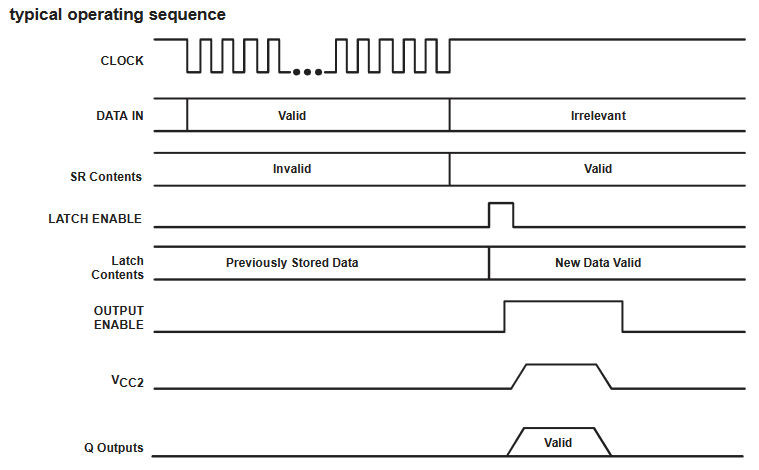

* `DOTCLK` -> Clock
* `SDATA` -> Data In
* `COLLAT` -> Latch Enable
* `DE` -> Output Enable


Things to notice:

* `DE` (Output Enable here) goes down for 17us in the last part of where serial data is still pushed. At the end of that width `COLLAT` (Latch Enable) goed up briefly. This presents the new data (128 bits worth) on the outputs to the Display after the Latch Enable.
* `DOTCLK` provides the (fast - 1 MHz!) clock signal when needed. It tends to always count up to 128.

### Image frame

Using `RDATA` to mark the start of a frame, it takes a period of 8.1885 ms per image frame. This frame has 32 rows times 128 pixels = 4096 bits (512 bytes). One second of recording takes a bit over 122 image frames, i.e. a 122 Hz Display refresh frequency. This comes to 62.5 kbytes/s worth of uncompressed image frame data.

#### On the Oscilloscope


Above, several `RDATA` image frames. Ch1: `RDATA`, Ch2: `RCLK`, Ch3: `DOTCLK`, Ch4: `SDATA`.

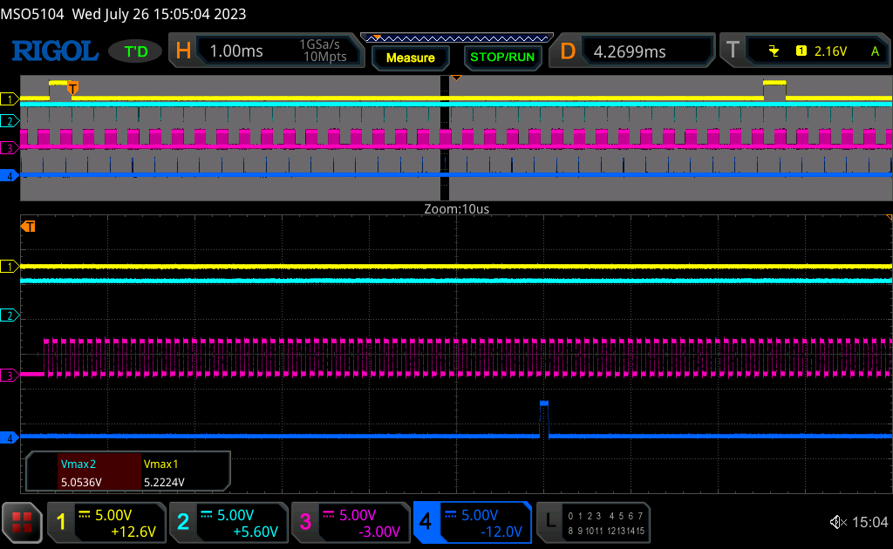

Above, zoomed into one image frame with one vertical line (ch4).

### Examples

#### One vertical line


Lets start with the vertical line and some general insights. Below is a picture of me slowly "zooming in" into the 1 MHz speed of the `DOTCLK` and accompanying `SDATA` data.


Things to notice in the huge image above:

* My LA probed at 200MHz, some articats show like in the `DE` near a `RDATA` signal. Same for `SDATA`, seems too short (5ns). It also misses some `SDATA` signals which is not possible with a vertical line.
* Notice the `DOTCLK` going bananas at Row32 (=row1). Same goes for `COLLAT`. My LA or a junk signal? How is it ignored by the DMD?
* My LA numbers the rows with an idle period _before_ `DOTCLK` 128 clock pulses. The Row should likely be counted as the `DOTCLK` starts and then the idle period _behind_ it. That makes sence with the `DE` disabling the Display while it is being Latched.

#### One horizontal line


## Pico

### Isolation

The Pico works with 3.3v inputs. It has an 5v out line, but connecting any 5v to a gpio or other pin will potentially destroy the Pico.

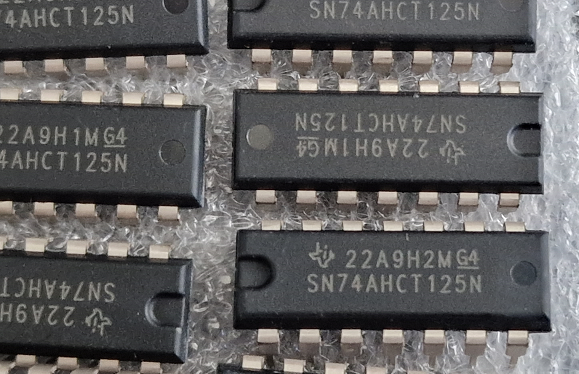

I have a few [sn74ahct125n](https://www.alldatasheet.com/datasheet-pdf/pdf/218060/TI/SN74AHCT125N.html) (4 channel isolator/ optocouplers) laying around. They are normally used for shifting 3.3 output voltage to 5. They can only be used one way. According to [adafruit](https://www.adafruit.com/product/1787) they work for 5 to 3.3 as well.

> You can also use it to connect 5V logic out to 3V logic in, that's when you want to power the 74AHCT125 with 3V, it can safely read 5V logic on the input pins.

Which I tested with the `DOTCLK` 1MHz signal to be sure. It worked ok bringing 5.62 input voltage down to 3.81.


### Thoughts

* Use `RDATA` to identify an image frame.
* Use `RCLK` to identify Rows. Not `COLLAT` as it goes bananas.
* Use `DOTCLK` as a clock signal, albeit it going bananas as well in row 32 (or LA error?).
* Use `SDATA` to get the column pixels.
* It was observed that Rows that are empty at the end of an image frame get ignored. That is, `RDATA` pulses and/or `RCLK` advances without `DOTCLK`/`SDATA` present. Needs more investigation.
* A PIO[01] can have 2 interrupts. I could use those as two 4096 bit (512 bytes) image frame dma complete triggers?
  * Though might be better to trigger every x frames, that way the Pico can optimize (frame duplication likely at 122 Hz?) and compress the data for sending over the Wifi.
  * Above: perhaps have 2 modes. One for transfer via wifi (optimized) and one a.s.a.p. mode to drive a local LCD display for replacement of the (broken) DMD?
  * Would it be possible to Huffman complete image frames? I bet the amount of animations are often repeated.

### First program

Using `RDATA` as a trigger on the faling edge the scope captured the output of the below program.

```pio
opnieuw:
.wrap_target
nop                 side 0b10
nop                 side 0b00
jmp pin opnieuw     side 0b00
nop                 side 0b11 [7]
```

The program does not make much sence. The `jmp pin` is tied to the Ch3 signal (`RDATA`). I realzed I should `wait 1 RDATA` then `wait 0 RDATA` to lock into the faling edge of the `RDATA` signal.


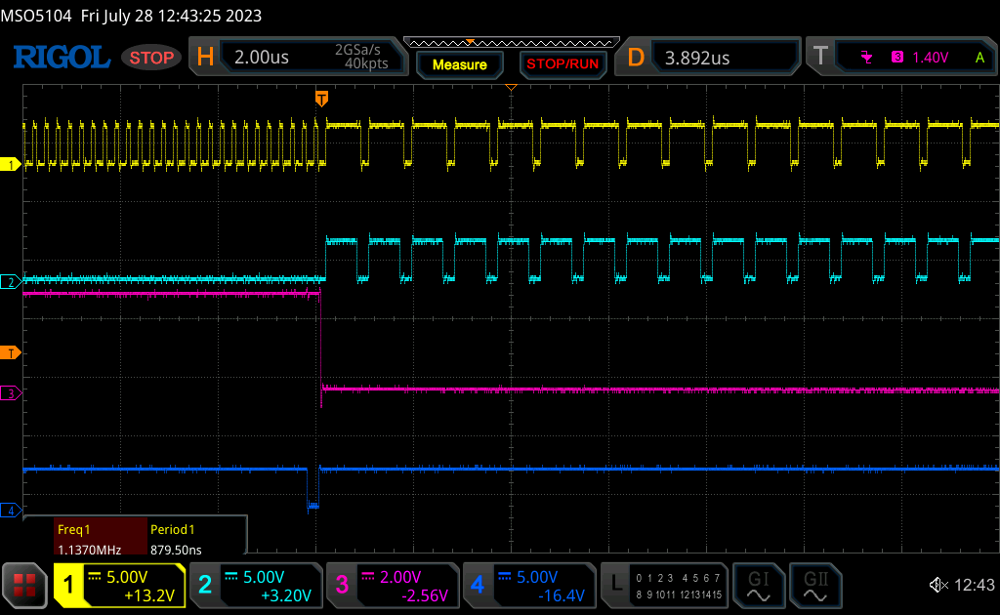
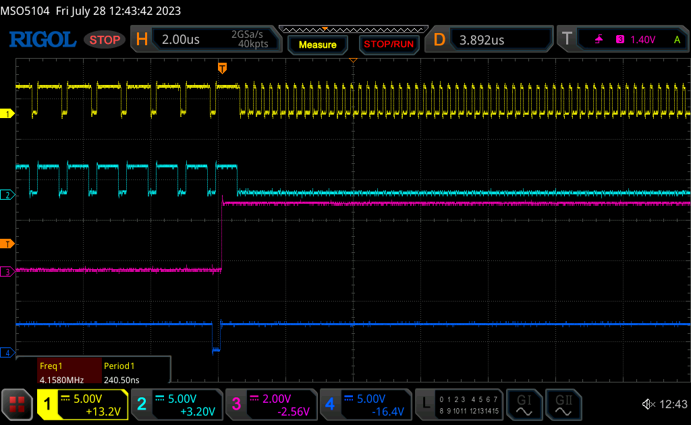

### A test program

Given that the pinball machine is downstairs and the computer is upstrairs, after a few times going up and down I've wrote a small test program. It is not accurate to a real signal, but works good enough to check pin configuration and triggering of the main pio program.

```pio
.wrap_target

set pins 0b0110 [31]
nop [29]
set pins 0b0010

set y, 31
line:

set pins 0b0000 [2]
set pins 0b0100 [31]

set x, 15
front_porch:

nop [31]
jmp x-- front_porch

set x, 15
vier:

set pins 0b1101
set pins 0b0101
set pins 0b1101
set pins 0b0100

set pins 0b1101
set pins 0b0101
set pins 0b1101
set pins 0b0101

set pins 0b1100
set pins 0b0100
set pins 0b1100
set pins 0b0100

set pins 0b1101
set pins 0b0101
set pins 0b1101
set pins 0b0100

jmp x-- vier
jmp y-- line

.wrap
```

Clock divider was set to 12.5.

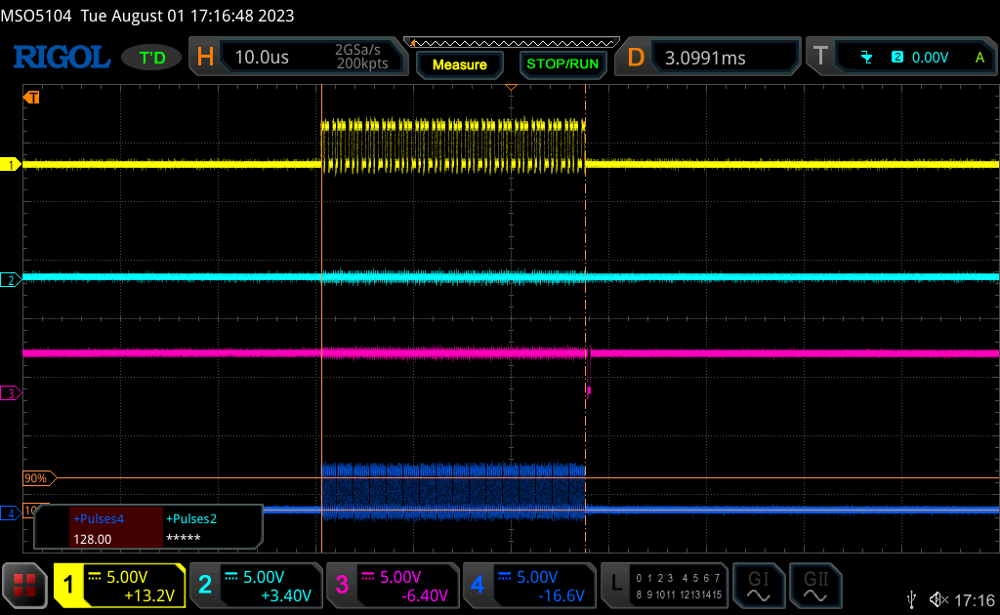
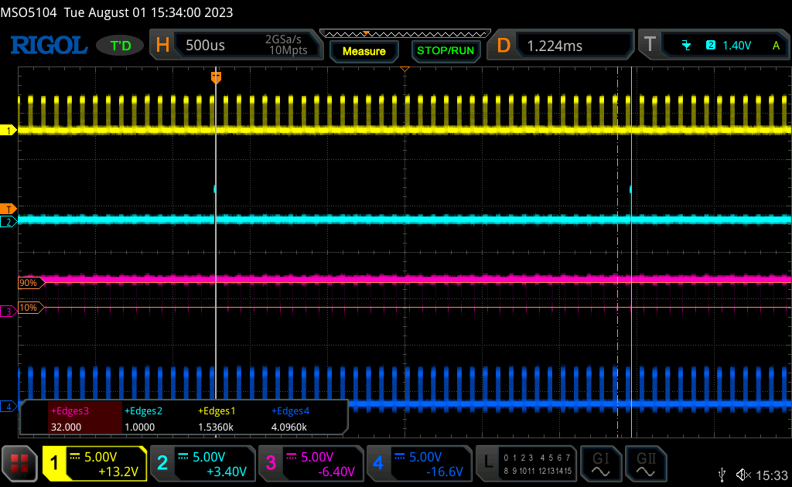

### A reading test program

Looks like it works a bit?

```terminal
        _____  __  __ _____  
       |  __ \|  \/  |  __ \ 
   _ __| |  | | \  / | |  | |
  | '__| |  | | |\/| | |  | |
  | |  | |__| | |  | | |__| |
  |_|  |_____/|_|  |_|_____/ 

rDMD Version 2023080118. See https://github.com/BjornHamels/rdmd

test-offset: 4
offset: 21
Waiting ...
☼·☼·☼☼☼☼☼·☼·☼☼☼☼☼·☼·☼☼☼☼☼·☼·☼☼☼☼☼·☼·☼☼☼☼☼·☼·☼☼☼☼☼·☼·☼☼☼☼☼·☼·☼☼☼☼☼·☼·☼☼☼☼☼·☼·☼☼☼☼☼·☼·☼☼☼☼☼·☼·☼☼☼☼☼·☼·☼☼☼☼☼·☼·☼☼☼☼☼·☼·☼☼☼☼☼·☼·☼☼☼☼
☼·☼·☼☼☼☼☼·☼·☼☼☼☼☼·☼·☼☼☼☼☼·☼·☼☼☼☼☼·☼·☼☼☼☼☼·☼·☼☼☼☼☼·☼·☼☼☼☼☼·☼·☼☼☼☼☼·☼·☼☼☼☼☼·☼·☼☼☼☼☼·☼·☼☼☼☼☼·☼·☼☼☼☼☼·☼·☼☼☼☼☼·☼·☼☼☼☼☼·☼·☼☼☼☼☼·☼·☼☼☼☼
☼·☼·☼☼☼☼☼·☼·☼☼☼☼☼·☼·☼☼☼☼☼·☼·☼☼☼☼☼·☼·☼☼☼☼☼·☼·☼☼☼☼☼·☼·☼☼☼☼☼·☼·☼☼☼☼☼·☼·☼☼☼☼☼·☼·☼☼☼☼☼·☼·☼☼☼☼☼·☼·☼☼☼☼☼·☼·☼☼☼☼☼·☼·☼☼☼☼☼·☼·☼☼☼☼☼·☼·☼☼☼☼
☼·☼·☼☼☼☼☼·☼·☼☼☼☼☼·☼·☼☼☼☼☼·☼·☼☼☼☼☼·☼·☼☼☼☼☼·☼·☼☼☼☼☼·☼·☼☼☼☼☼·☼·☼☼☼☼☼·☼·☼☼☼☼☼·☼·☼☼☼☼☼·☼·☼☼☼☼☼·☼·☼☼☼☼☼·☼·☼☼☼☼☼·☼·☼☼☼☼☼·☼·☼☼☼☼☼·☼·☼☼☼☼
☼·☼·☼☼☼☼☼·☼·☼☼☼☼☼·☼·☼☼☼☼☼·☼·☼☼☼☼☼·☼·☼☼☼☼☼·☼·☼☼☼☼☼·☼·☼☼☼☼☼·☼·☼☼☼☼☼·☼·☼☼☼☼☼·☼·☼☼☼☼☼·☼·☼☼☼☼☼·☼·☼☼☼☼☼·☼·☼☼☼☼☼·☼·☼☼☼☼☼·☼·☼☼☼☼☼·☼·☼☼☼☼
---- Closed the serial port COM5 ----
```

As seen on the scope.


Via the below (inefficient) program with debug pins and random comments.

```pio
.program readdmd

; Debug, ~indicate reading.
.side_set 1 opt

; The signal lines. SDATA is 0 as it needs to be the base pin for IN.
.define RDATA  1
.define RCLK   2
.define DOTCLK 3
.define SDATA  0


; Start of the loop.
.wrap_target


; ! Detect start of image frame.
; SN75558FN: serial data is entered into the shift register on the high-to-low transition of the clock input.
; So, wait for the RDATA to go high while the RCLK goes low. This identifies the start of an image frame.
wait 1 pin RDATA side 1     ; Side: indicate not reading any data in.
wait 0 pin RDATA


; TODO: use irq for 1 image frame? - consider about ors = 128 store?
;                                  - consider using free reg for line count?
;                                  - consider no way to find corrupted lines, thus always push 0filled?
; Clear possible remaining row pixel data from the isr. TODO: reconsider above.
mov isr, null


; ! Detect one pixel row.
wait 0 pin RCLK


; Set up the 128 loop counter. One loop(y) of 4 times one loop(x) of 32 equals 128 pixels we need per row.
; The pio cannot set higher than 31, idea: load this register once to 128 with ISR?
set y, 3            

; ! Detect pixels.
; SN75555FN: serial data is entered into the shift register on the low-to-high transition of CLOCK.
ypixels:
set x, 31 side 1    ; Side: (re-)indicate not reading any data in.


xpixels:
wait 0 pin DOTCLK
wait 1 pin DOTCLK


IN pins, 1  ; Uses SDATA, side: indicate reading-data.

; Loop 128 times.
jmp x-- xpixels
jmp y-- ypixels


.wrap
```

To be continued. Perhaps test on the pinball machine?

## Some more Logic Analysing later

I love this Rigol MSO5104. This is where the MSO (mixed signal oscilloscope) in the name comes in handy.

### Why

Since I'm kind of stuck with the pio pico programming (nee, understanding how dma and the tasks work), I'm going to pursuit making a better image frame generator. That is a small Pi Pico that can generate dmd screens. It needs dma etc as well, but that way I can experiment with that and learn how to read via that Pi Pico connected.

For that, lets get a better logic analyser.

### Findings

I wanted to see if the weird signals I saw with my DSLogic Plus were really there, so I bought a Rigol PLA2216 logic probe. This connects to my Rigol MSO5104.

> **N.b.** D2 and D3 were mistakenly not labeled. D2 is `RCLK` and D3 is `COLLAT`.

#### The general and the weird

Here below you see column 128 being on. It's one of the test modes that can only light a single column and row. You can see a pretty clean signal. This will change if more data is displayed.


##### Pattern every 8 SDATA bits

This is one of the more weird things. Also the reason I connected Ch1 to `SDATA`, to see if perhaps the line was floating. But something upstream interfears with the `SDATA` signal at regular intervals of every 8 bits.

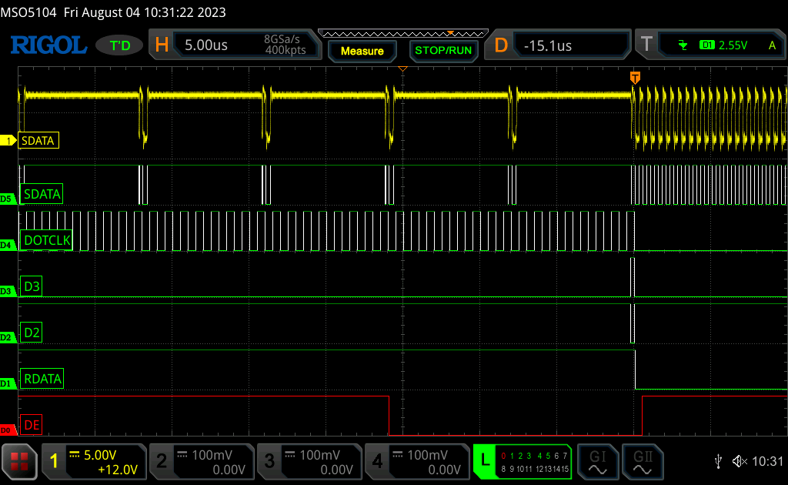

But as the sn75555fn (see above) loads data into the shift register on a low to high clock signal, this weirdness is ignored.


Besides the pattern, another thing I noticed is junk data. Seen in screenshot above, any `SDATA` when there is no `DOTCLK` is ignored (see datasheet sn75555fn). So the thing happening on the `SDATA` line after the Trigger (the orange T) with no `DOTCLK`present - is ignored. Why is it there? I don't know.


You'll see more of this pattern below in the Row or Column headings. Perhaps something upstream is parallel to serial shift rigister latching in new data?


Above you see the pattern in the animaged png for an image frame containing only 1 column of data vs 1 row of data. I.e. only the first pixel on on this row vs all pixels on on this row.

It happens between the reading (rising edge of `RCLK`) of the `SDATA`, so it is never "noticed".

#### Rows

A row has 128 pixels, 32 rows make up one image frame. The DMD driver board shifts in a `1` at the beginning of each image frame on `RDATA`. So it is a good way to identify the start of an image frame.


Above you see that the DMD receives a bit over 122 images frames per second. So that is around 8.2 ms per frame. Row 1 was enabled.

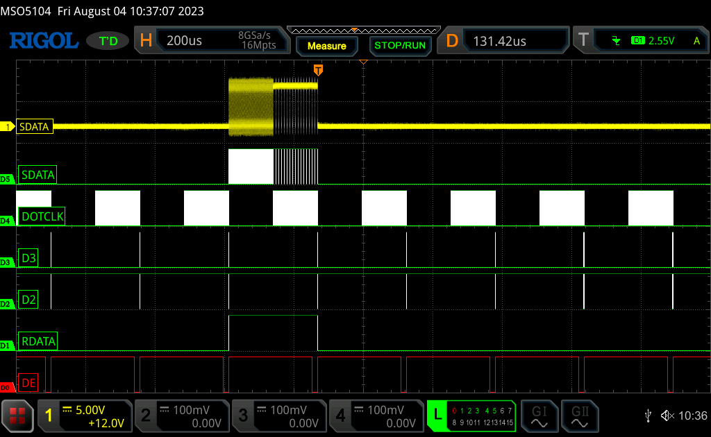

Above you see the animated png pauze on row 1 and then lighting up the next row in steps. Thus row 1 "starts at" the `RDATA` high signal. Previously I mentioned the rows might be reversed, thus the image being sent "up side down". But that might not be the case, as shown above.

Lets zoom in a bit on the falling edge of the `RDATA`, what I tend to call the back porch.

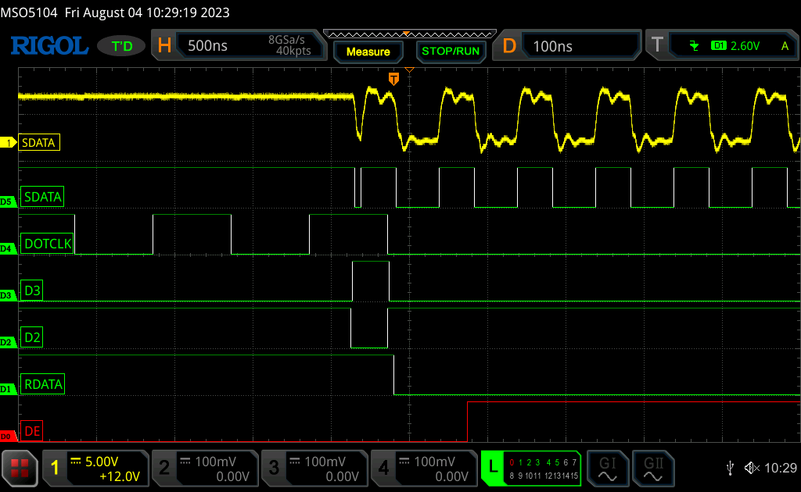

Things to notice above:

* Before the trigger (orange T) valid data is loaded into the column shift register. After there is no `DOTCLK`, so that is ignored.
* The `RCLK` (D2) is triggered on the faling edge, so it enables the first row to be displayed.
* The `COLLAT` (D3) latch is triggered to transfer the shift registers to the output. So given the point above, the received data is displayed from that point on when `DE` goes high (~400 ns later).

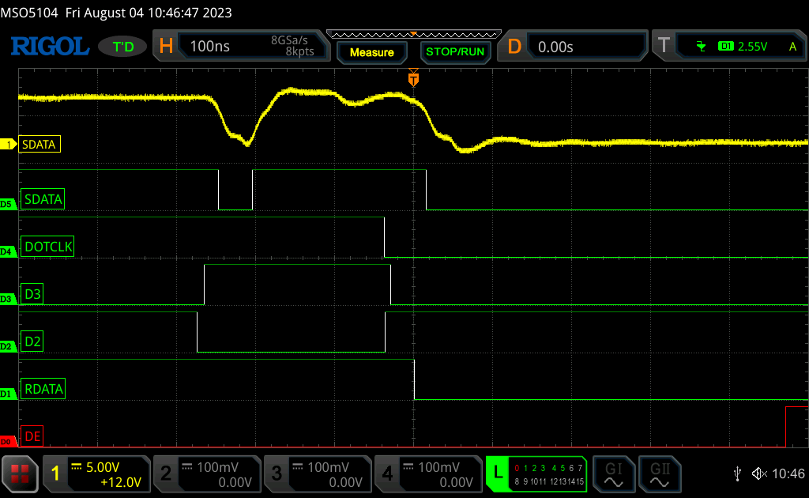

Timings are a bit better visable above.

#### Columns

This is me cycling through the first few columns via the test menu manually. The animation pauses on column 1.

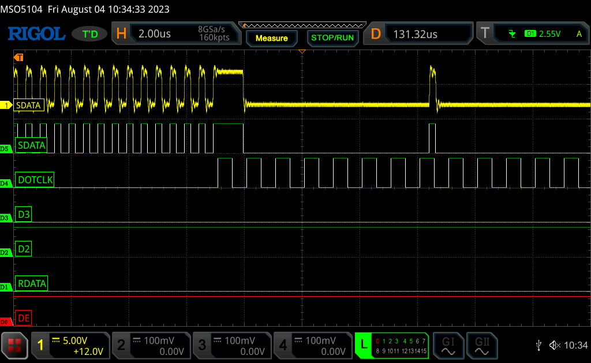

Things to notice above:

* On the column 1 you see a lot of junk `SDATA` that is ignored as there is no `DOTCLK` present.
* You see 2.5 `DOTCLK` cycles per devision (2 us). The frequency of the `dotclk` is 1 MHz.
* The 8-bit weird pattern is visable near the end of the animation. It does not change the output of the data, as always it happens between the 2 rising edges of `DOTCLK`.
* We're not on row 1, as we don't see any control signals indicating that (D0-D3).

### Download and see for yourself

I've zipped three waveforms and my settings so you can [download them](3waves1setting.zip). It contains csv files of:

* only row 1 being lit;
* only column 128 being lit;
* a complete image frame with some signal  before and after.

### Wave diagrams

Via [wavedorm](https://wavedrom.com) I made some diagrams of how I understand the data to be sent to the DMD at this time.

#### High level overview

```wavedorm
{"signal":[["Column",{"name":"SDATA","wave":"x3.x.3.x.3.x.3","data":["pixel data","p d row 1","p d row 2"]},{"name":"DOTCLK","wave":"l6.l.6.l.6.l.6","data":["1Mhz clk","128 cycl","T: rising e"]},{"name":"COLLAT","wave":"0..0...0...0..","node":"W..X...Y...Z.."}],{},["Row",{"name":"RCLK","wave":"1..1...1...1..","node":"A..B...C...D.."},{"name":"RDATA","wave":"0..1...0......","node":"...I...J......"}],{},["DMD",{"name":"DE","wave":"h......lh......lh......lh.....","period":"0.5","phase":"1"},{"name":"(image seen)","wave":"8......8......","data":["frame x","frame x+1"]},{"name":"(row seen)","wave":"9..9...9...9..","data":["31","32","1","2"]}]],"edge":["Z-|->Y Trigger: rising edge","C-|->D Trigger: falling edge","I+J 256 us"],"head":{"text":"High level example of the signals to the DMD"}}
```


* `DE` is in reality much much shorter (around 20 us).
* The pulses on `COLLAT` and `RCLK` are around the same time and inverted to eachother. They are quite short (bit over 200 ns).
